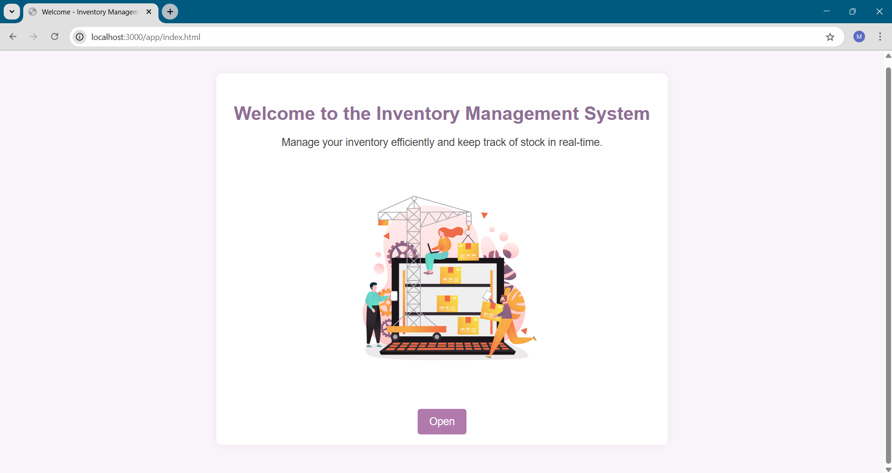
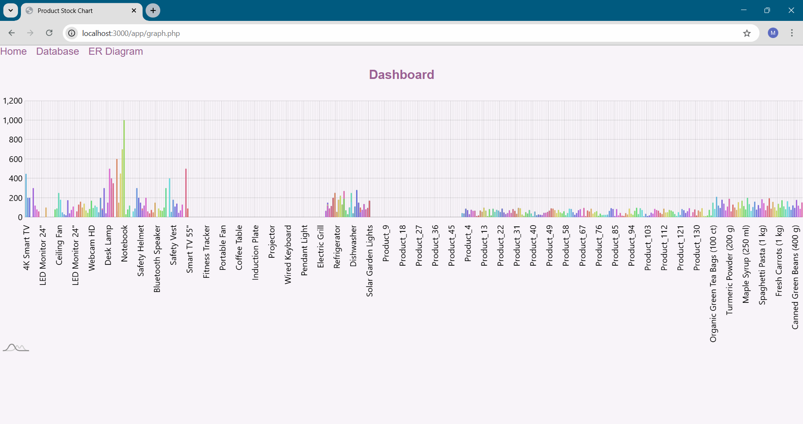
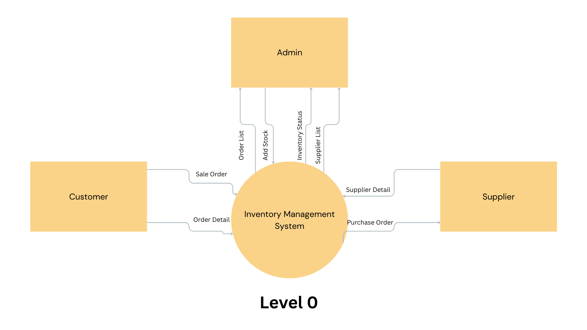
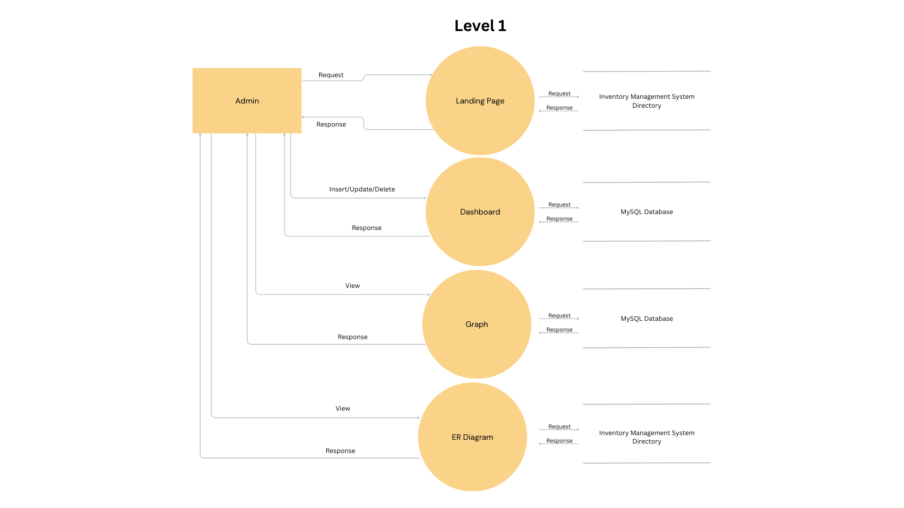
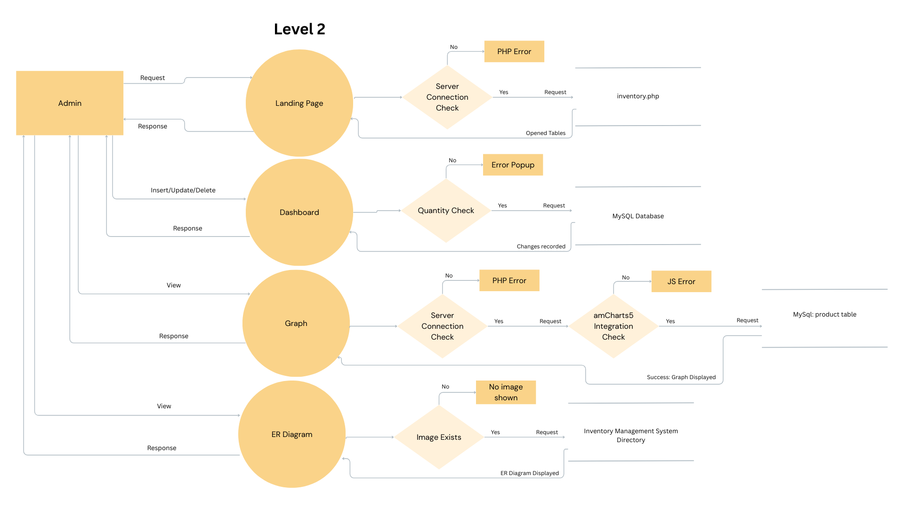

# inventory-management-system

# 📦 Inventory Management System

## 📘 Overview

This Inventory Management System is a web-based solution designed for efficient tracking and management of products, suppliers, warehouses, purchase orders, and sales. The system ensures real-time stock updates, robust data integrity, and visual analytics for informed decision-making. Built using **PHP** and **MySQL**, it leverages best practices in database normalization (BCNF) and enforces data consistency with `ON DELETE CASCADE` constraints.

---

## ✨ Features

- ✅ **Real-time Stock Management:** Automatic stock increase on purchase, decrease on sale, and reversal on deletion.
- 🔐 **Data Integrity:** `ON DELETE CASCADE` maintains referential integrity across all tables.
- 📊 **Visual Analytics:** Graphs display current stock, sales, and purchase trends.
- 🧭 **User-Friendly Interface:** Dropdown menus and auto-validation for efficient operations.
- 📄 **Comprehensive Reporting:** Track inventory, supplier performance, and sales history.

---

## 🔄 Product Quantity Updates on Transactions

| Action           | Effect on Product Quantity      |
|------------------|--------------------------------|
| Purchase         | Increases quantity             |
| Sale             | Decreases quantity             |
| Delete Purchase  | Decreases quantity             |
| Delete Sale      | Increases quantity             |

---

## 📸 Project Screenshots

> Below are some screenshots of the Inventory Management System interface.

### 🖥️ Landing Page  

### 📋 Product Management Page  

### 📈 Graphical Analytics View  

---

## 🗄️ Database Schema

- **Suppliers:** `supplier_id` (PK)
- **Products:** `product_id` (PK), `supplier_id` (FK), `warehouse_id` (FK), `quantity_in_stock`
- **Warehouses:** `warehouse_id` (PK)
- **PurchaseOrders:** `order_id` (PK), `supplier_id` (FK)
- **PurchaseOrderDetails:** `detail_id` (PK), `order_id` (FK), `product_id` (FK), `quantity`
- **Sales:** `sale_id` (PK)
- **SalesDetails:** `detail_id` (PK), `sale_id` (FK), `product_id` (FK), `quantity`

> All foreign keys use `ON DELETE CASCADE` for automatic cleanup of related records.

---

## 📊 System Architecture

### 🗂️ Entity-Relationship (ER) Diagram

---

### 🔄 Data Flow Diagrams (DFDs)

#### 📥 Level 0: Context Diagram

---

#### 🔁 Level 1: Functional Overview

---

#### 🔂 Level 2: Detailed Process Flow

---

## ⚙️ How It Works

- **Admin:** Manages products, suppliers, inventory, and views analytics.
- **Customer:** Places sale orders and views order details.
- **Supplier:** Receives purchase orders and updates supplier info.
- **System:** Updates inventory and ensures data consistency automatically.

---

## 🧰 Technologies Used

- 💻 **Backend:** PHP  
- 🛢️ **Database:** MySQL  
- 📈 **Visualization:** amCharts5  
- 🧮 **Design Tools:** Canva (for DFDs and ER Diagram)  

---

## 🚀 Getting Started

1. **Clone the repository** and set up your PHP and MySQL environment.
2. **Import the database schema** from the provided SQL file.
3. **Configure your database connection** in the PHP source code.
4. **Launch the application** via a local or hosted PHP server.
5. **Use the dashboard** to manage inventory and visualize performance.

---

## 🌱 Future Enhancements

- 🔐 User authentication and role-based access control.
- 📦 Exportable reports and customizable dashboards.
- ⚠️ Automated low-stock alerts and order confirmations.

